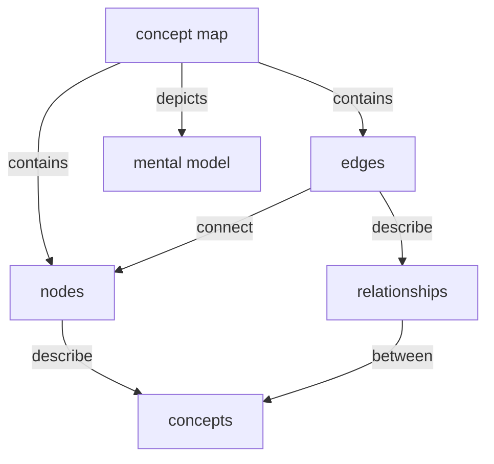

```
---
title: Lesson Design Notes
---
```

## Target Audience

Bioinformaticians or computational biology, more specifically in the public health sector

### Notes

1.What is their background?
Bioinformaticis or computational biology, more specifically in the public health sector

2.What do they already know how to do?
They are already competent practitioners in Nextflow (they know about channels, operators, processes, and how to create a simple workflow), and they know at least one coding language e.g. Bash or Python

3.What do they want to do with the skills they will learn from your lesson?
Independently create a Nextflow workflow in a a structured (likely step-wise) fashion using tools created by the nf-core community

4.What problem will your lesson help them solve?
Creating a Nextflow workflow in a standardized i.e. consistent i.e. reproducible way. Having the freedom to create their own workflows.

### List of prerequisite knowledge
- Compentent in Nextflow with knowledge of channels, operators, processes and workflows
- Command line 
- A coding language such as Bash or Python
- How to use a code editor such as VS Code
- Knowledge of version control with Git
- General knowledge of bioinformatics data (file types) and tools (e.g., FastQC, trimming software, assemblers, aligners, etc)

NOTE: conceptualize learner profiles

## Lesson Learning Objectives

### Learning Objectives
After following this lesson, learners will be able to:
 
* Use nf-core tools to download community developed pipelines and modules.
    * Toby: "use" feels vague, and I wonder whether you could reorganise the sentence to put "download" at the beginning without changing the meaning substantially?
* Adapt existing nf-core pipelines with a custom parameter and a test profile.
    * Toby: This one is great!
* Understand the structure of meta maps and set a meta map variable in an nf-core pipeline.
    * Toby: can you avoid "understand" here? Will setting the variable demonstrate that understanding, or is there something important about where/the way that learners would set this variable that you could capture here? I don't know enough about Nextflow/nf-core to make a specific suggestion but verbs like "modify" or "adapt" (as used above) could be a good place to start?
* Create a nf-core module using nf-core tools.
    * Toby: I like this one too. If modules can get quite complicated, you could try to capture the level of complexity here, e.g. "create a simple nf-core module" or similar. "Simple" is still not very specific, but it could help to manage learners' expectations/make clear that the lesson will not be exhaustive.
* Script a simple 4-step (trimming, quality control, assembly, and analysis) genome assembly nextflow pipeline in nf-core formatting style.
    * Toby: nice.
 
Edits based on feedback:

* Download community developed pipelines and modules using nf-core tools.
* Adapt existing nf-core pipelines with a custom parameter and a test profile.
* Describe the structure of meta maps and modify a meta map variable in an nf-core pipeline.
* Create a simple nf-core module using nf-core tools.
* Script a simple 4-step (trimming, quality control, assembly, and analysis) genome assembly nextflow pipeline in nf-core formatting style.

### Notes

FIXME add any relevant information about how and why you defined these objectives. 
Information like this can be helpful for future collaborators/contributors/users to understand the scope of your lesson.


## Data Set/Narrative

FIXME add notes about any criteria you used when choosing a data set and/or narrative for your lesson.  

* Which datasets and narratives did you consider?
* How and why did you choose between them?
* What implications do you think your choice of dataset and/or narrative will have for the design and further implementation of your lesson?

### Exercise: Choosing a Dataset or Narrative (30 minutes)

Referring to [the advice you reviewed before this training](https://docs.carpentries.org/resources/curriculum/narrative-example-data.html), find an appropriate dataset or a narrative for your lesson.
Identify one or more potential candidates and note down the advantages and disadvantages of each one.

As a summary, here are some aspects we suggest that you consider:


* For datasets:
    * size - downsamples reads 
    * complexity
    * "messiness"/noise
    * relevance to target audience
    * availability (publicly available on NCBI)
    * license (public domains)
    * ethics (sequenced in a public health lab using taxpayer dollars, uploaded under CDC guidence, completely de-identified, no mention of facility sampled from)
* For narratives:
    * authenticity (pretty authentic, classic example of analysis performed by PH bioinformaticians)
    * relevance to target audience (relavent because it is highly practicaly analysis)
    * complexity
    * possibility to teach useful things first/early (yes, genome assembly and analysis is one of the fundamental bioinformatics skills)

Take notes in your Lesson Design Notes document about your discussion and the decisions made. It may be particularly helpful to record:

* Which datasets and narratives did you consider?
    * 5 isolate samples from an E. coli outbreak in a hospital associated with torn surgical scope. These samples are NDM positive, an important antibioitic resistance gene tracked in the US and across the globe. This data is publicly available on NCBI database.
    * Another option was 30 samples from mycobacterium bacteria, which are nontuberculous mycobacteria samples. This dataset is more complex and the outbreak dynamics would have been difficult to summarize. This data is part of this study (pseudo-outbreak of Mycobacterium mucogenicum linked to ice machine).
    * Both datasets were considered, since outbreaks are one of the most common analyses done in public health.

* How and why did you choose between them?
    * Chose E. coli data set because it was smaller and easier to summarize. More cut and dry. The FASTQs could also be downsampled without risk of losing resolution, which is not always the case for Mycobacteria.
* What implications do you think your choice of dataset and/or narrative will have for the design and further implementation of your lesson?
    * This limits the number of analysis tools we would choose for the fourth step in the workflows the students would create, but we have a short list already in mind.

NOTE: Make it known this is a **public health** data set in the lesson title


## Episodes

Edits based on feedback:

* Download community developed pipelines and modules using nf-core tools.
* Adapt existing nf-core pipelines with a custom parameter and a test profile.
* Describe the structure of meta maps and modify a meta map variable in an nf-core pipeline.
* Create a simple nf-core module using nf-core tools.
* Script a simple 4-step (trimming, quality control, assembly, and analysis) genome assembly nextflow pipeline in nf-core formatting style.

FIXME use this section to take notes as you create a list of episodes for your lesson. 

1. An Introduction to nf-core: development community and nf-core tools (Abigail)
    - Description of nf-core
    - nf-core website
    - Introduce nf-core tools
2. Running an nf-core pipeline (CJ)
    - Downloading the pipeline
    - Description of input and output parameters
    - General outdir location
    - Usage and help documentation (website and CLI)
    - Running on cli
3. Adapt existing nf-core pipeline with custom parameters and test profile
    - Change input parameters on cli and params-file
    - Add parameter
    - Create test profile
    - Run pipeline with test profile
    - Describe output
4. Create a pipeline using nf-core tools
    - Use with creation nf-core wizard
    - Go over the template
5. Adding modules to our nf-core pipeline
    - Module structure
    - Downloading modules
    - Update workflow file
6. Creating your own module
7. Meta maps
8. Creatinga a simple nf-core pipeline

After you have produced this list, assign one episode to each collaborator in your team.
They will focus on this episode for the rest of this training.


### Episode Learning Objectives
FIXME use the space below to draft a set of learning objectives for your episode.


#### 1. An introduction to nf-core
After following this episode, learners will be able to:
 
* Define nf-core and explain its connection to Nextflow
* List and explain the six main benefits of using the nf-core framework
* Find nf-core community-made pipelines and modules on the nf-core website
* List nf-core community-made pipelines on the command line using nf-core tools

#### 2. Running an nf-core pipeline
After following this episode, learners will be able to:
* Utilize nf-core tools to download a pipeline on command line
* Describe the inputs and outputs of pipeline
* Run the demo nf-core pipeline on the command line using the built in test profile

#### 3. Adapt existing nf-core pipeline with custom parameters and test profile
* Overriding default nf-core pipeline parameters using command line arguments
* Add a new parameter to an nf-core pipeline using a custom parameter file
* Create a new profile to test an nf-core pipeline with a custom data set
* Explain the file structure of an nf-core pipeline's output directory

#### 4. Create a pipeline using nf-core tools
* Create a pipeline based on the nf-core pipeline template using the nf-core pipeline creation tool
* Describe the file structure of nf-core pipelines

#### 5. Adding modules to our nf-core pipeline
#### 6. Creating your own module
#### 7. Meta Mapshttps://en.wikipedia.org/wiki/The_Ghost_and_the_Darkness
#### 8. Creating a simple nf-core pipeline

## Designing Exercises
FIXME use the space below to draft exercises to help you assess learners' progress towards the objectives you defined for your episode.

#### 1. An introduction to nf-core
* Exercise 1 (5 minutes): Take a moment to reflect on the Nextflow workflows you've written or worked on. How might the nf-core framework improve the scripting of your workflow(s)? After reflecting, discuss with the people (or person) next to you.
* Exercise 2 (5 minutes): 
    1. What `nf-core` command would you use to list any bacterial genome assembly pipelines? <- maybe this would be stronger as a fill in the blank?
    2. How many genome assembly pipelines are there?
    Answers: 
        * `nf-core pipelines list bacterial genome assembly`
        * Seven

#### 2. Running an nf-core pipeline
* Exercise 1 (5 minutes) : 
    1. What command would you use to download the 'bacass' pipeline using the `nf-core tools`? 
    2. What additional flags would you add to your command that would download the specific version of 2.6.0?
    3. What `nextflow` command would you run that would provide the inputs and outputs of the pipeline?
    Answers: 
        * `nf-core pipelines download bacass`
        * `nf-core pipelines download bacass --revision 2.6.0`
        * `nextflow run nf-core/bacass --help`

#### Exercise: Examples Before Exercises (20 minutes)
Looking back at one of the exercises you designed before: what examples could you include in your narrative to teach learners the skills they will need to apply to complete the formative assessments you have designed?

Outline one of these examples in your design notes document.

##### Examples:
**In the Software Carpentry Plotting and Programming with Python Lesson:**
Exercise to load and inspect CSV file for Americas ->
In the lesson, the Instructor demonstrates how to load the data table for another continent (Oceania) and explores the values with a few different functions. This shows learners how to call the function to load the CSV into a data frame, and demonstrates what success looks like for this task.

**In the Python Interactive Data Visualization Lesson in the Incubator:**
Exercise to find the correct widget (a slider) for an action and modify the script to use it ->
In the lesson the instructor introduces a cheatsheet and documentation for interactive widgets and then creates a dropdown widget for the application. The slider widget required in the exercise has not been demonstrated but the preceding example shows all of the necessary steps to add a widget, and provides the supporting information that learners can consult to discover how to implement the specific tool.

### Examples before exercises
FIXME use this space to make some notes about examples/narrative you could use to demonstrate the skills/teach the knowledge that learners will need to complete the exercise(s) you designed above. 

#### 1. An introduction to nf-core
* Exercise 1 (5 minutes): Take a moment to reflect on the Nextflow workflows you've written or worked on. How might the nf-core framework improve the scripting of your workflow(s)? After reflecting, discuss with the people (or person) next to you. 
    * Prior to this exercise, the instructor would describe that nf-core is both a framework and a community built around creating standardized Nextflow workflows according to a specific set of guidelines. There are six main benefits to the nf-core framework outlined in nf-core's main publication that the instructor could define (community, guidelines, portability, reproducibility, standardization, and research impact).

* Exercise 2 (5 minutes): 
    1. What `nf-core` command would you use to list any bacterial genome assembly pipelines? <- Note from past to future Abigail: Maybe this would be stronger as a fill in the blank?
    2. How many genome assembly pipelines are there?
    Answers: 
        * `nf-core pipelines list bacterial genome assembly`
        * Seven
    * Prior to this exercise, the instructor would demonstrate the usage of the `nf-core` starting with `nf-core --help`. They would then describe the most important subcommands for the lesson (`pipelines` and `modules`) and demonstrate the usage of `nf-core pipelines --help` and `nf-core pipelines list`. This section should close with an explanation of filtering pipelines with keywords using `nf-core pipelines list`.

#### 2. Running an nf-core pipeline
* Exercise 1 (5 minutes) : 
    1. What command would you use to download the 'bacass' pipeline using the `nf-core tools`? 
    2. What additional flags would you add to your command that would download the specific version of 2.6.0?
    3. What `nextflow` command would you run that would provide the inputs and outputs of the pipeline?
    Answers: 
        * `nf-core pipelines download bacass`
        * `nf-core pipelines download bacass --revision 2.6.0`
        * `nextflow run nf-core/bacass --help`
    * Prior to this exercise, the instructor would have downloaded the demo pipeline with the attendees coding along. This example would include pulling a specific revision and veiwing help information. Learners would then apply this to the bacass pipeline.]
## Glossary of terms
FIXME add a list of terms or jargon from your lesson, along with their definitions.
The syntax below will make your glossary render nicely when added to the `learners/reference.md` page of your lesson.

1. An introduction to nf-core

Workflow
:  A way of describing work to be done as a set of tasks, typically with 
  dependencies on external inputs or the outputs of other tasks, which can  
  later be executed by a program. An example is a Makefile which can be
  executed by the make Unix command. 
  
nf-core
:  nf-core is a community effort to collect a curated set of analysis 
  workflows built using Nextflow.
  
  nf-core provides a standardized set of best practices, guidelines, and  
  templates for building and sharing bioinformatics workflows. These 
  workflows are designed to be modular, scalable, and portable, allowing 
  researchers to easily adapt and execute them using their own data and 
  compute resources.
  
Portability
:   A design objective for source code to be easily made to run on different
  platforms
  
Reproducibility
:  Rhe ability of an independent person or computer to run the exact same 
  code and input data to get the same results 

Runtime
:  Referring to Nextflow runtime engine, which is the executor of the software. In this lesson this is reffereing to the core scripts that are running, managing the logic of the code, and orchestrating the running of our nextflow scripts. These are the scripts 'under the hood'... 

Executor
:  The executor is the executing the scripts and works with the runtime to schedule and run tasks...

Computing infrastructure
: 

Repository
: 

Containerization
: 
  
2. Running an nf-core pipeline

Pipeline
: 
Flag
: 

Term 1
: Definition 1
  add more lines here
  if you need to
  but indent them 
  by two spaces
  each time

Term 2
: Definition 2
  and so on...

## Completing lesson metadata
FIXME add questions and key points that summarise the most important messages of your episodes below. 
We typically aim to write the key points as answers to the questions.
An episode typically answers 1-3 questions.

### An introduction to nf-core
#### Questions
* What is nf-core?
* Why should I use the nf-core framework?
* How can I list and filter nf-core pipelines on the command line?

#### Key Points
* nf-core is a community-led project to develop a set of best-practice pipelines built using the Nextflow workflow management system.
* nf-core is portable, reproducible, and standardized, making it an ideal framework for workflow design
* The nf-core tool (nf-core) is a suite of helper tools that aims to help people run and develop nf-core pipelines.
* nf-core pipelines can be found using nf-core pipelines list, or by checking the nf-core website.


---

## Additional Design Notes

FIXME add notes to this section that do not fit elsewhere
in the page. Topics for this section might include

- what has been tried that did not work
- learning objectives that you decided to remove (e.g. to trim down the content) and why
- concept maps for all or part of your lesson (see the section below)


## Concept Maps

Concept maps are a useful tool for describing the relationships between concepts. They can be used to visualise one's mental model of a topic. You can use this section to add concept maps that illustrate the design of your lesson and/or the most important information you are trying to communicate in your lesson/its episodes. 

You can embed a photo or other image file, or use the [Mermaid.js](https://mermaid.js.org/) syntax demonstrated below.




### Lesson Concept Map

You can put concepts maps for the whole lesson here...


### Episode Concept Maps

...and concept maps for individual episodes here.


:::info
General questions or feedback? Contact [team@carpentries.org](mailto:team@carpentries.org).
:::

### Teaching Plan
Create a bullet point list or brief notes describing what you will say and do when teaching the episodes you have been focussing on during this training.

#### 1. An introduction to nf-core

* Start with a brief discussion of Nextflow and workflow management languages
* Describe lesson objectives, connecting back to Nextflow
* Then describe what nf-core is and explain that it is a both a community and a framework for structuring Nextflow workflows
* After that, describe the nf-core figure and list the six main benefits of using nf-core
* Next pause for discussion exercise (5 minutes)
* Then pull up nf-core website, highlighting the Pipelines and Modules pages, followed by the Docs and Resources pages if you have time
* While on the Pipelines pages, show learners the GitHub repo link to the pipeline bacass
* Next, open your code editor of choice, talk about nf-core tools, and demonstrate the usage of `--help`
* After demonstrating `nf-core --help` explain that there are different subcommands of `nf-core` and that this episode will cover the `pipelines` subcommand
* Then explain and demonstrate the use of `nf-core pipelines list` and pause for questions
* Assign the pipelines list exercise (5 minutes) and explain the solution afterwards
* Close and explain key points

#### 2. Running an nf-core pipeline

* Connect the last episode of nf-core by talking about the nf-core tool, describing how we will now use it to download a pipeline.
* Brief review of nextflow commands to setup nf-core tools download command. The learners should be familiar with nextflow and should be helpful in introducing nf-core commands. Next introduce nf-core tools command for downloading pipelines
* Introduce how to download a pipeline, going through nf-core tooles pipeline download commands and flags important for downloading specific pipelines
* Download the demo pipeline and go through some of the help information. Do first on the command line and then go through on nf-cores website. Showing usage and help and other information on the pipelines.
* Then run the demo command in the command line using the built in test profiles
* Go throught exercise 1. having them download the pipeline and talk through outputs. 
* Ask what questions the may have.

#### Exercise: Add Setup Instructions and/or Instructor Notes (15 minutes)
Add setup instructions (in the `learners/setup.md` file) with a list of software/tools/data needed by participants to follow your lesson and links on how to obtain and install them.
Rather than producing a separate page in the lesson site, the contents of `learners/setup.md` will be combined with `index.md` to produce the Learner View of the landing page of your lesson.

Add Instructor Notes (in the `instructors/instructor-notes.md` file) with an initial list of points that will help you and other instructors deliver the lesson.

(If you want to put your Instructor Setup Instructions in a separate file, you can do that by adding a `.md` file to the `instructors/` directory. Do not forget to include the front matter YAML at the beginning! It will only need to include the `title` field.)

* Instructor Notes
    * Rationale
        * This workshop is intended to teach the nf-core framework to learners with prior Nextflow experience. The main goal of this workshop is to impart the utility of using a standardized system for Nextflow workflow development and give learners the basic skills needed to create a simple, four-step nf-core pipeline.
    * Tips for teaching this lesson
        1. Take plenty of time to describe the most important subdirectories and files in an nf-core workflow, particularly the `modules` directory and file types, as well as the `workflows` directory and file(s).
        2. Meta maps are Groovy, not Nextflow, syntax, so go slowly when describing their structure and function to learners.

## Wrap-up
*Con
